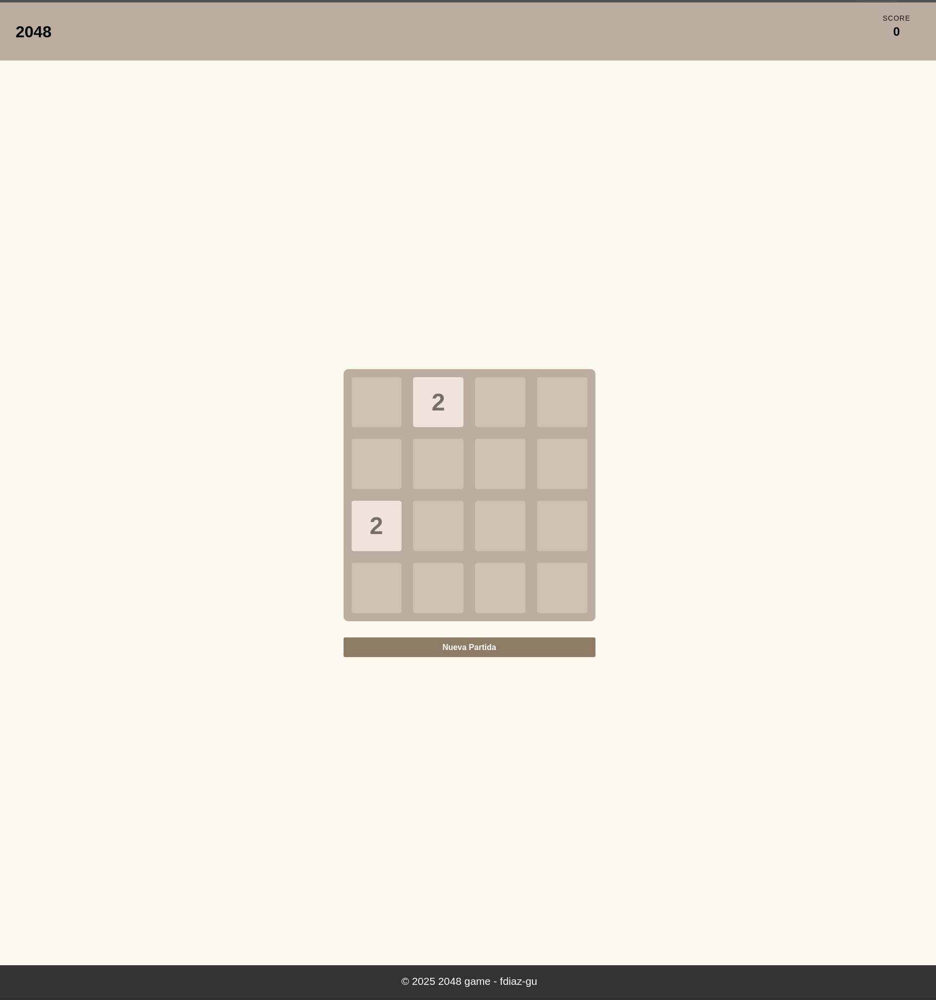

# 2048 🎮

Recreación del clásico juego **2048** en Vanilla JavaScript, CSS y HTML puro. Combina tiles numéricas para alcanzar el número 2048 y obtener la máxima puntuación.

<div align="center">
  
  <p><em>Interfaz del juego 2048</em></p>
</div>

## 📋 Tabla de Contenidos

- [Características](#características)
- [Cómo Jugar](#cómo-jugar)
- [Instalación y Ejecución](#instalación-y-ejecución)
- [Arquitectura del Proyecto](#arquitectura-del-proyecto)
- [Documentación Técnica](#documentación-técnica)

---

## ✨ Características

✅ **Juego completamente funcional** con tablero 4x4 dinámico  
✅ **Animaciones suaves** - tiles que se deslizan y se fusionan fluidamente  
✅ **Controles por teclado** - Flechas del teclado (↑ ↓ ← →)  
✅ **Sistema de puntuación** - Suma automática basada en merges  
✅ **Tiles nuevas aleatorias** - Aparecen al azar después de cada movimiento  
✅ **Detección de Game Over** - Identifica cuando no hay más movimientos  
✅ **Botón de reinicio** - Comienza una nueva partida en cualquier momento  
✅ **Responsive** - Se adapta a diferentes tamaños de pantalla  
✅ **Modo Docker** - Deploy containerizado con nginx

---

## 🎯 Cómo Jugar

### Objetivo
Combina tiles numéricas con el mismo valor para crear números más grandes. Llega al **2048** para ganar, pero puedes seguir jugando para obtener una puntuación más alta.

### Controles

| Tecla | Acción |
|-------|--------|
| **↑** (Arriba) | Desplaza todos los tiles hacia arriba |
| **↓** (Abajo) | Desplaza todos los tiles hacia abajo |
| **←** (Izquierda) | Desplaza todos los tiles hacia la izquierda |
| **→** (Derecha) | Desplaza todos los tiles hacia la derecha |
| **Botón Reiniciar** | Comienza una nueva partida |

### Reglas

1. **Movimiento**: Al presionar una flecha, todos los tiles se desplazan en esa dirección hasta chocar con el borde o con otro tile.

2. **Fusión**: Cuando dos tiles con el **mismo número** se tocan después de un movimiento, se combinan en una sola tile con el valor **duplicado** (2+2=4, 4+4=8, etc.).

3. **Puntuación**: Cada fusión suma el valor resultante a tu puntuación total.

4. **Nuevas tiles**: Después de cada movimiento, una nueva tile (con valor 2 o 4) aparece en una posición aleatoria vacía.

5. **Victoria**: Cuando creas una tile con valor **2048**, ¡ganaste! (Puedes seguir jugando).

6. **Derrota**: El juego termina cuando:
   - No hay espacios vacíos
   - No hay tiles adyacentes con el mismo número
   - No se pueden hacer más movimientos

## 🚀 Instalación y Ejecución

### Docker 🐳 (Recomendado y necesario)

El proyecto se ejecuta con **Docker Compose**, que proporciona el entorno correcto con nginx.

1. **Asegúrate de tener instalados**:
   - [Docker Desktop](https://www.docker.com/products/docker-desktop) 
   - Docker Compose (viene incluido en Docker Desktop)

2. **Ejecuta desde la carpeta `2048`**:
   ```bash
   cd 2048
   docker compose up --build
   ```

3. **Abre en tu navegador**:
   - `http://localhost`
   - O `http://localhost:80`

4. **Para detener el contenedor**:
   ```bash
   docker compose down
   ```

---

## 🏗️ Arquitectura del Proyecto

```
2048/
├── index.html                 # Estructura HTML estática
├── Dockerfile                 # Configuración para Docker
├── docker-compose.yml         # Orquestación de contenedores
├── README.md                  # Este archivo
│
├── assets/
│   ├── css/
│   │   ├── globals.css       # Estilos globales y reset
│   │   └── style.css         # Estilos del juego y animaciones
│   ├── js/
│   │   ├── index.js          # Punto de entrada (Event Listeners)
│   │   ├── board.js          # Lógica del tablero (Clase Board)
│   │   └── tile.js           # Lógica de tiles individuales (Clase Tile)
│   └── img/
│       └── favicon.ico       # Icono de la página
```

---

## 📚 Documentación Técnica

### Stack Tecnológico

- **HTML5**: Estructura semántica
- **CSS3**: Grid, Flexbox, Animaciones CSS, Transforms
- **JavaScript ES6+**: Módulos, Clases, Arrow Functions, Promises
- **Docker**: Containerización con nginx

### Componentes Principales

#### 1. **Clase Board** (`board.js`)

Gestiona la lógica completa del juego:

**Métodos principales:**
- `constructor(size = 4)` - Inicializa el tablero 4x4
- `startGame()` - Limpia el tablero y coloca 2 tiles iniciales
- `moveLeft() / moveRight() / moveUp() / moveDown()` - Ejecuta movimientos con animaciones
- `spawnRandomTile()` - Genera una nueva tile en posición aleatoria
- `compressLine(rowValues)` - Comprime los valores eliminando espacios
- `combineTiles(rowValues)` - Fusiona tiles adyacentes con mismo valor
- `checkGameState()` - Verifica victoria o derrota
- `hasMoves()` - Determina si hay movimientos disponibles

**Propiedades:**
- `grid[][]` - Matriz 4x4 de objetos Tile
- `score` - Puntuación acumulada
- `boardElement` - Referencia al DOM
- `floatingLayer` - Capa de animaciones superpuesta

**Animaciones:**
- Las tiles se deslizan usando transforms CSS con transiciones de 400ms
- Se usa una "capa flotante" (floating layer) con tiles clonadas para las animaciones
- Las tiles nuevas tienen animación de aparición (pop)

#### 2. **Clase Tile** (`tile.js`)

Representa una tile individual:

**Métodos:**
- `constructor(value, row, col, domElement)` - Inicializa una tile
- `updateClass()` - Aplica las clases CSS correctas según el valor

**Propiedades:**
- `value` - Valor numérico (2, 4, 8, 16, ..., 2048)
- `row, col` - Posición en el grid
- `dom` - Elemento DOM asociado

#### 3. **Archivo Principal** (`index.js`)

Punto de entrada que:
- Crea la instancia del Board
- Inicia el juego con `startGame()`
- Agrega listeners para las teclas de flecha
- Vincula el botón de reinicio

### Flujo de Movimiento

```
1. Usuario presiona flecha (↑ ↓ ← →)
   ↓
2. Se capturan posiciones originales de tiles
   ↓
3. Se calcula estado final (compress + combine + compress)
   ↓
4. Se crean tiles "flotantes" (clones) en capa superpuesta
   ↓
5. Se animan los clones desde origen → destino (400ms)
   ↓
6. Se vacía contenido de tiles originales (sin clases)
   ↓
7. Se espera a que termine la animación
   ↓
8. Se actualizan valores del grid con updateClass()
   ↓
9. Se genera nueva tile aleatoria
   ↓
10. Se verifica estado del juego (continuar, victoria, derrota)
```

### Sistema de Animaciones

**CSS Classes por valor:**
```css
.tile.two       → 2 (color claro)
.tile.four      → 4
.tile.eight     → 8
.tile.sixteen   → 16
.tile.thirty-two → 32
.tile.sixty-four → 64
.tile.hundred   → 128
.tile.two-hundred → 256
.tile.five-hundred → 512
.tile.thousand  → 1024
.tile.two-thousand → 2048 (color oscuro)
```

**Animaciones disponibles:**
- `tile-new` - Tiles que aparecen (pop animation)
- `transform transition` - Deslizamiento suave de tiles

### Ejemplo de Lógica: Fusión

```javascript
// Si tenemos [2, 2, 0, 4]
compressLine([2, 2, 0, 4])        // → [2, 2, 4]
combineTiles([2, 2, 4])            // → [4, 0, 4] (fusiona los 2s)
compressLine([4, 0, 4])            // → [4, 4] (posición final)
```

---

## 🔧 Configuración de Desarrollo

### Requisitos
- Navegador moderno (Chrome, Firefox, Safari, Edge)
- Docker (opcional, solo si usas la versión containerizada)


¡Diviértete jugando! 🎉
  
